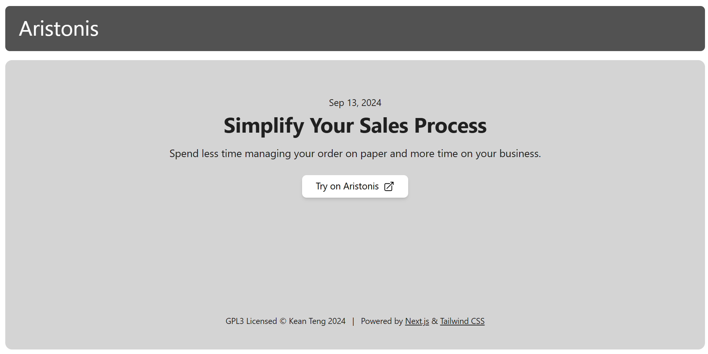
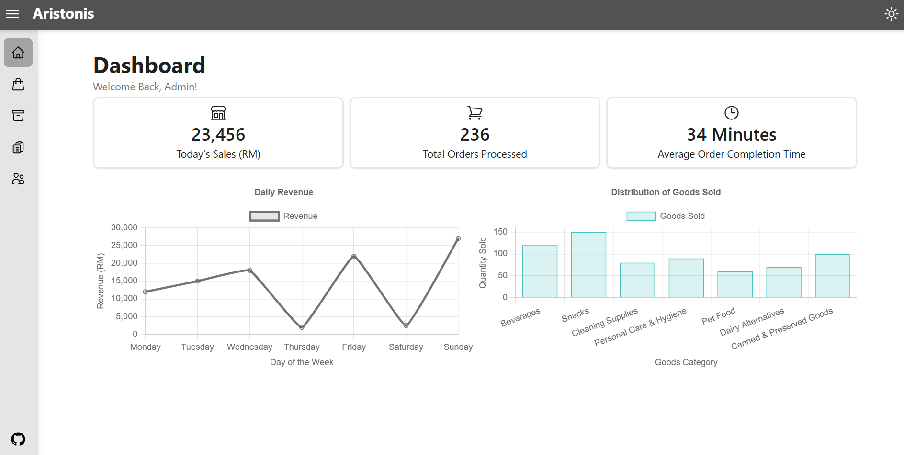
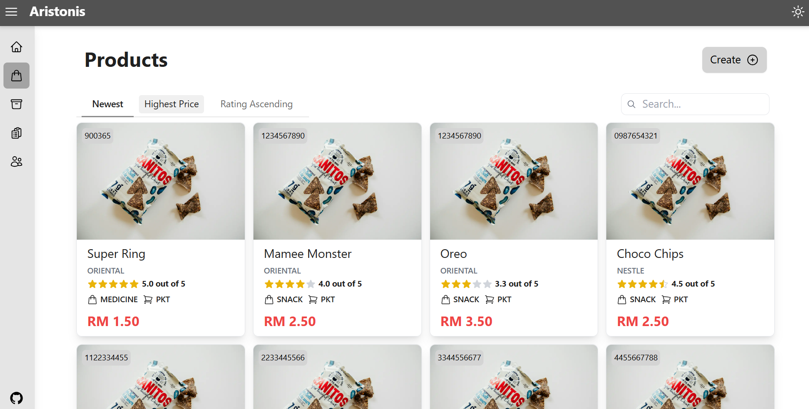
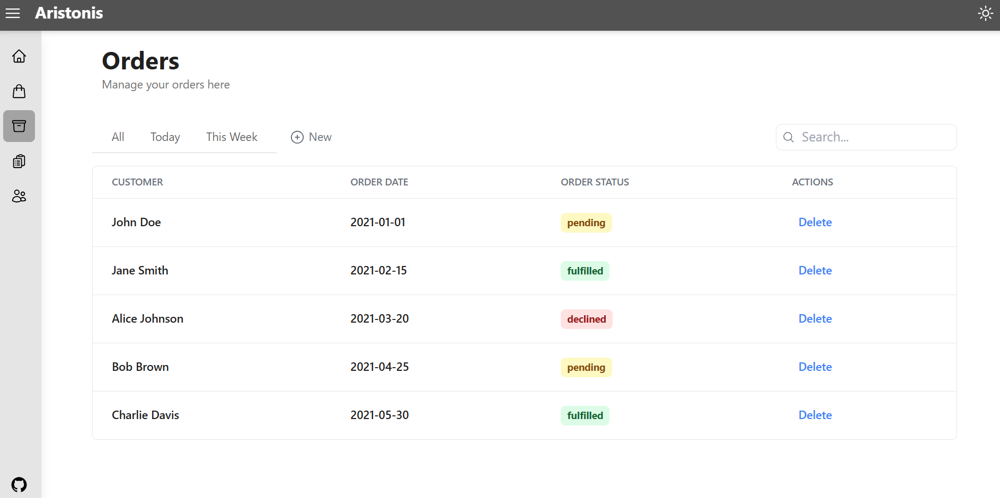
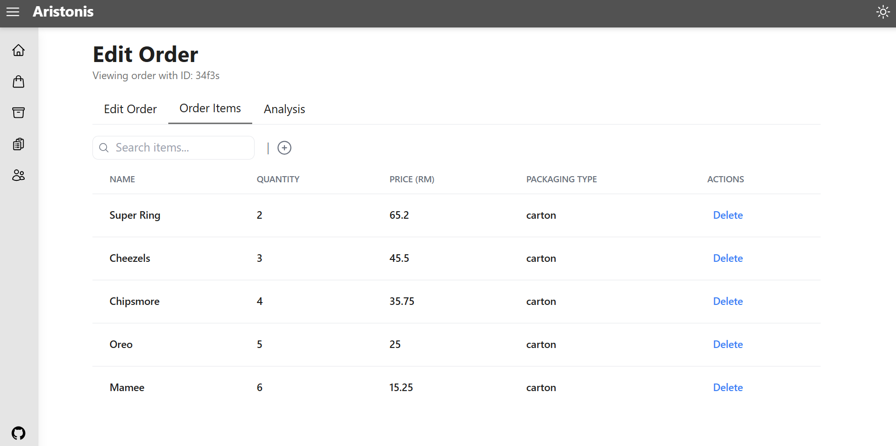
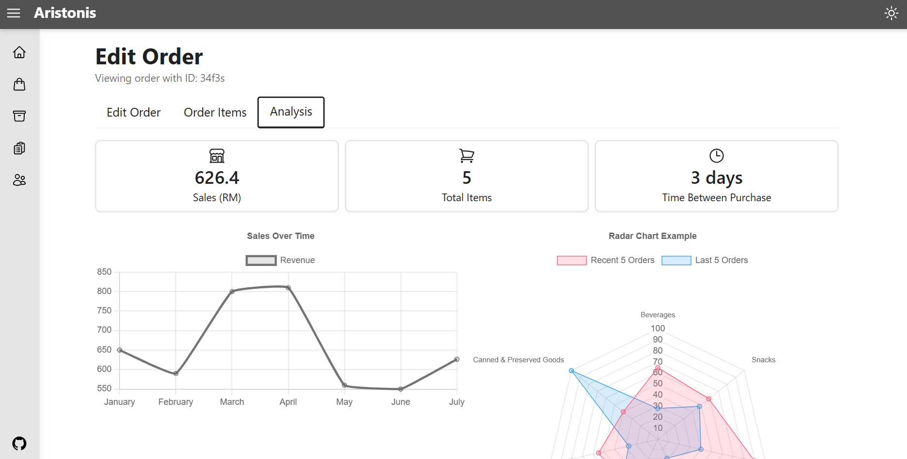
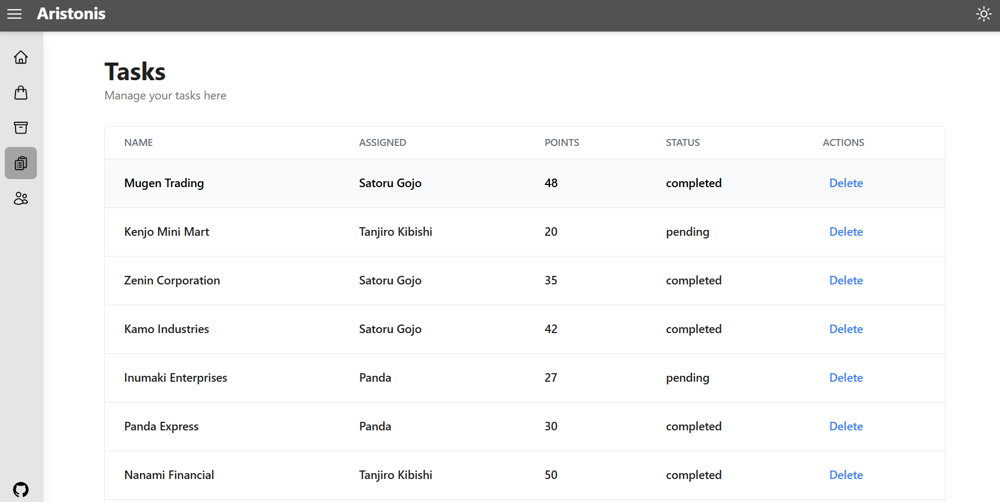

# Aristonis  - Smarter Sales Management


Aristonis is a **UI prototype** for a smarter sales management. Its objective is to streamline and digitalize the work flow of goods trading business. The project emphasizes on areas such as product catalogue, order creation, tasks assignment and some relevant analytics. 

The project is build using [Next.JS](https://nextjs.org/docs), and the UI is powered mainly by [Tailwind CSS](https://tailwindcss.com/) and some [Radix UI](https://www.radix-ui.com/). 

## Live Demo
https://aristonis.vercel.app/

## Preview








## Getting Started 

```bash
# start development
npm run dev

# perform linting/ build checking
npm run build
```

## Usage Story

1. Product catalogue provides a central place to manage and show the products that you sell, with search and filter functions, we are able to query product information faster.
2. Digitalize order creation speed up order processing and tasks assignment so that order can be completed fast. It aims to allow user to add and track each order easily. Also, for storekeepers, they are able to process the order timely.
3. Order analytics are key to let user their business performance and their customer's business performance, by tracking these data, it provides insight to understand metrics such as trend and season/holiday effects.
